<h1 align="center">
  📖ENGJOY📖
</h1>

<td align="center">
      EngJoy là phần mềm học tiếng Anh có chức năng chính tra cứu, chơi game để ghi nhớ từ vựng.
</td>

## Preview
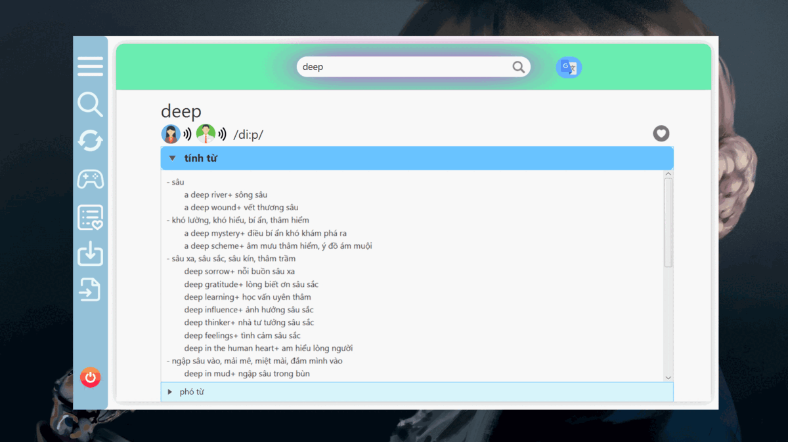

## Ngôn Ngữ Lập Trình

- Java

## CommandLine Version
Phiên bản commandline có các chức năng  
[0] Exit (thoát commandline)  
[1] Add (thêm 1 từ vào từ điển nhập từ bàn phím)  
[2] Remove (xóa 1 từ khỏi từ điển nhập từ bàn phím)  
[3] Update  
[4] Display (hiện tất cả các từ trong từ điển)  
[5] Lookup (tìm kiếm chính xác 1 từ)  
[6] Search (tìm kiếm từ bắt đầu bằng keyword vd: “tra”: transport, translate,transform, transit, ...  
[7] Game (Hangman)  
[8] Import from file (lấy dữ liệu từ file vào từ điển)  
[9] Export to file (xuất từ điển hiện tại ra file)  

## Graphical Interface Version

      Phiên bản đồ họa sử dụng Javafx.

## Chức năng chính

### Tra cứu
- Tra cứu với từ điển có sẵn
  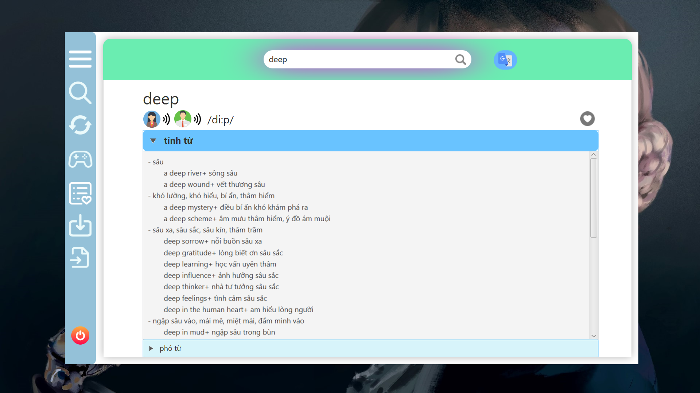
- Tra cứu với API Google Translate
  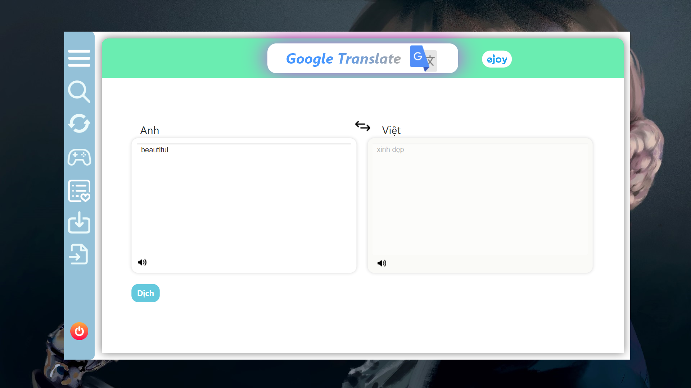
  
### Thay đổi từ điển
  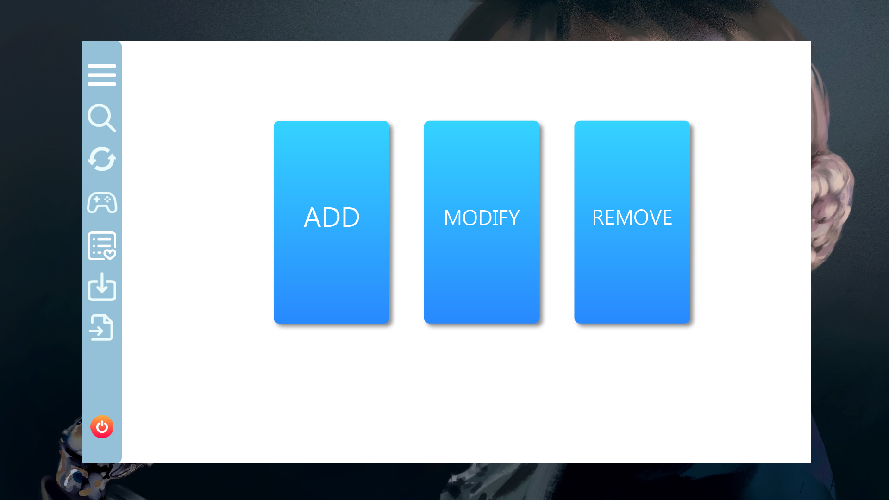
- Thêm từ mới vào từ điển
  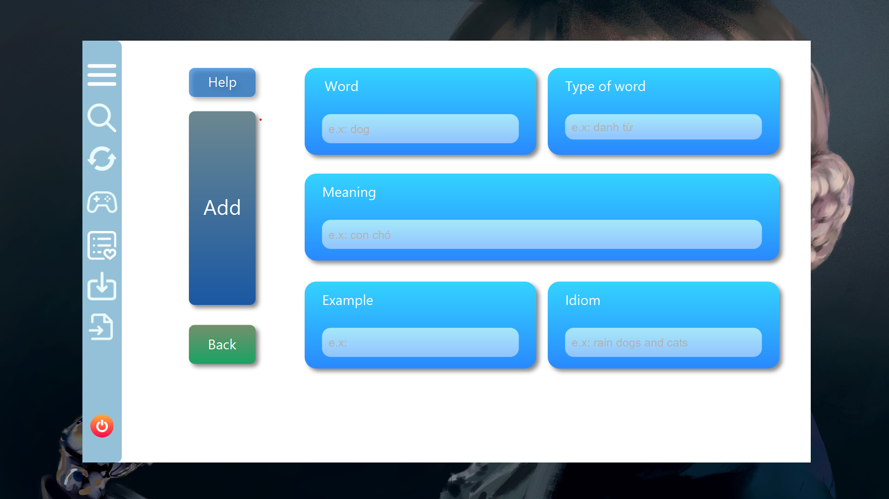
- Sửa từ có sẵn trong từ điển
  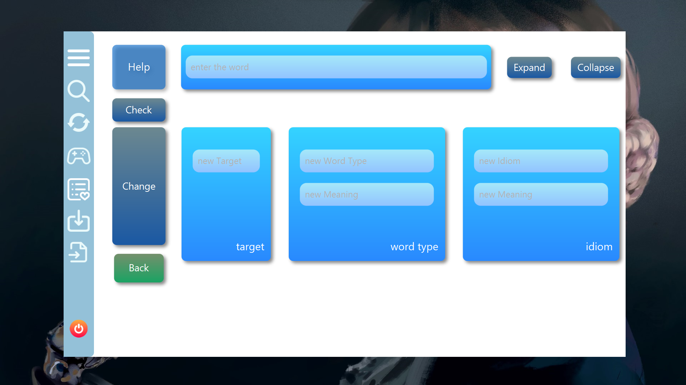
- Xóa từ khỏi từ điển
  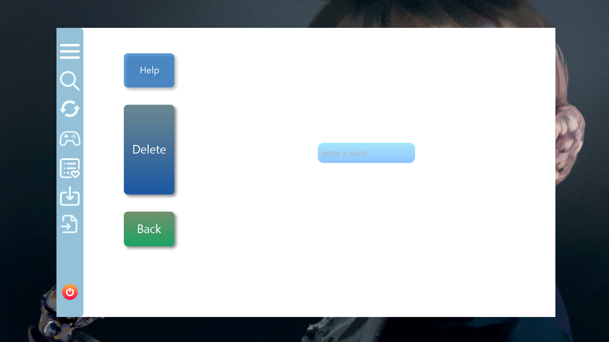
  
### Xuất từ điển ra file
  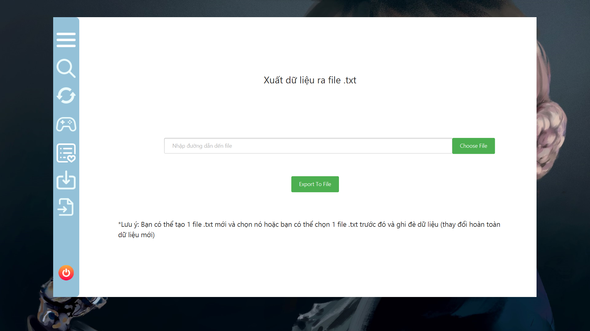

### Lấy dữ liệu từ điển từ file
  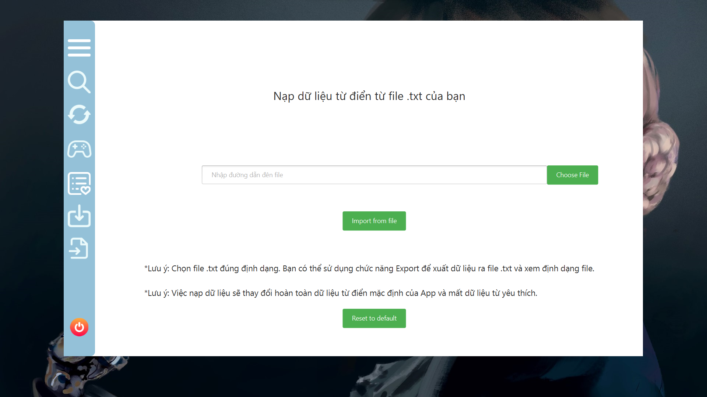

### Từ yêu thích
  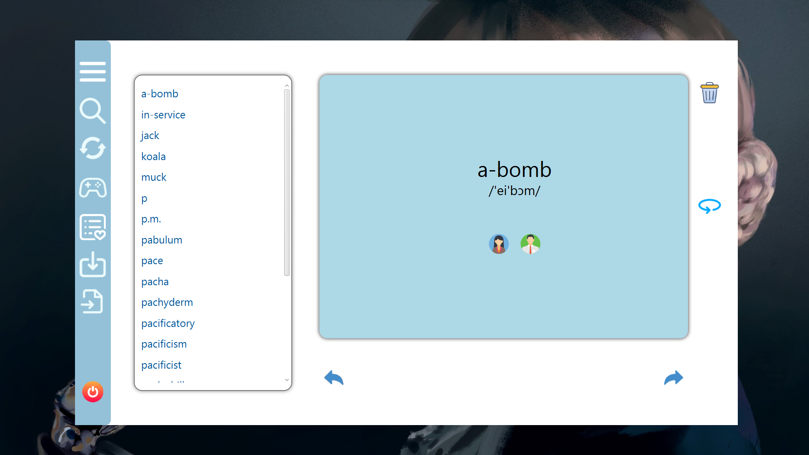

### Game 
  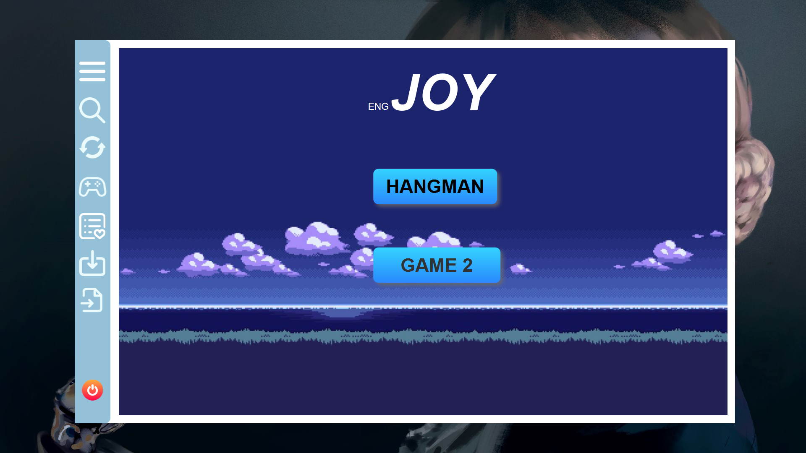
  
#### HangMan
- Luật chơi
  + Bạn đoán các chữ cái có trong từ
  + Mỗi lần đoán sai, HangMan sẽ được vẽ thêm 1 nét
  + Sau 6 lần vẽ, HangMan sẽ bị treo cổ
  + Nhiệm vụ của bạn là đoán ra từ trước khi HangMan hẹo
    
- Xu trong game
  + Xu có được khi bạn đoán ra từ (số thưởng bằng độ dài của từ)
  + Dùng xu để mở gợi ý giúp từ trở nên dễ đoán hơn
    
- Màn hình bắt đầu
  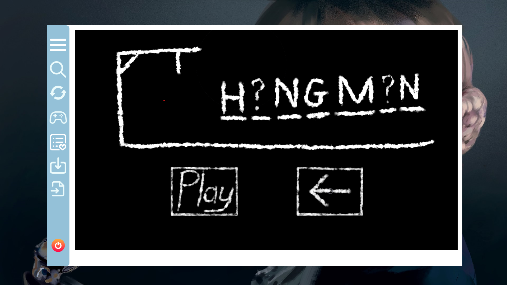
- Màn hình trong game
  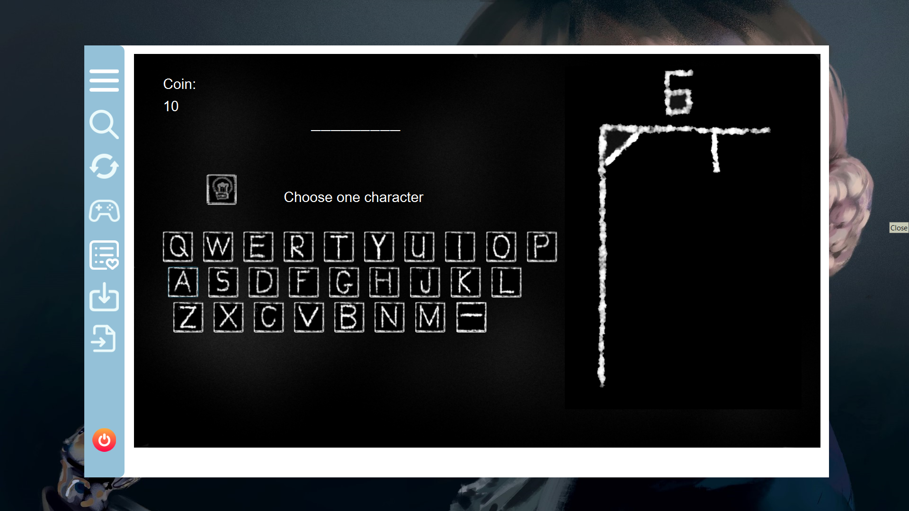

## Vấn Đề Hiện Tại
[Vấn đề](https://docs.google.com/document/d/1-SUf40TSZftbNKuVo4aXF1CV_L9JyQYqU9YXWo2wl-s/edit?usp=sharing)

## Hướng Cải Thiện
[Hướng cải thiện](https://docs.google.com/document/d/1wCLYnoC5x17vU2C4KXLkaqNCvNgtFaJalPha-isga1k/edit?usp=sharing)

## Thành viên
[Thành viên dự án](https://docs.google.com/document/d/1Soil4nMZP8VWtQ4k9xoNc9tHOG_kmCQrgvYEsOYKOes/edit?usp=sharing)

## Nguồn Tham Khảo
- [Learning JavaFX BroCode](https://youtube.com/playlist?list=PLZPZq0r_RZOM-8vJA3NQFZB7JroDcMwev&si=cSfSYinfG4E50Lf4)
- [StackOverFlow](https://stackoverflow.com/)

## Liên Hệ
Mọi thắc mắc, góp ý vui lòng trao đổi qua email thaiduongabcdef@gmail.com

## Rất mong nhận được sự đóng góp từ bạn :heart: !

